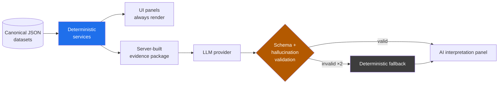

# Risk Stream Explorer

A synthetic, fully simulated UBS-style **operational-risk workbench**. Five
surfaces over one 1,000-event synthetic dataset, each pairing a deterministic,
fully auditable computation layer with a **grounded** LLM analyst that can only
ever speak about server-verified facts.

> No component in this repo uses real UBS data. Every event, pattern,
> organisation and person is generated for demonstration purposes.

**→ Full documentation: [docs/](docs/README.md)**

---

## What it answers

| Page | Question | Route | Guide |
| --- | --- | --- | --- |
| Landing | "Where do I start?" | `/` | [docs](docs/pages/landing.md) |
| Risk Stream | "How did risk *move over time*?" | `/streamgraph` | [docs](docs/pages/streamgraph.md) |
| Relationship Network | "*Who and what* is connected to this risk?" | `/graph` | [docs](docs/pages/relationship-network.md) |
| Executive Risk Overview | "Which *issues* deserve attention, and why?" | `/issues` | [docs](docs/pages/issues.md) |
| Pattern Intelligence | "Which *statistical patterns* are worth investigating?" | `/patterns` | [docs](docs/pages/patterns.md) |

Two independent timelines exist in the data — the **streamgraph dataset**
(1,000 narrative events with rich detail + pre-generated insight text) and the
**risk dataset** (1,000 structured risk events + 137 mined patterns). They are
deliberately kept separate; see [the data model](docs/data-model.md).

## Core principle: deterministic first, AI second

Every number displayed anywhere in the UI is computed by TypeScript from the
canonical JSON datasets. The LLM never computes, never counts, and never sees
client-supplied "facts" — it receives a server-built evidence package and is
allowed only to *interpret* it. If the model is unreachable, unconfigured, or
returns something that fails validation, **the deterministic panel still
renders in full**.



How that is enforced — evidence packages, double validation, hallucinated-ID
rejection, bounded retries, graceful fallback: [AI grounding](docs/ai-grounding.md).

## Quick start

```bash
npm install
```

Components 1–3 are a pure static frontend and need only:

```bash
npm run dev
```

The AI panels additionally need the backend API:

```bash
cp backend/risk-stream-explorer/.env.example backend/risk-stream-explorer/.env
# set OPENROUTER_API_KEY (optional — without it every deterministic panel
# still works and the AI panels show a fallback)
npm run dev:server   # API on :3001
```

Or run the whole thing on one origin with no CORS to configure:

```bash
npm run build && npm run dev:server   # then open http://localhost:3001
```

Full run modes, environment variables and every script: [development](docs/development.md).

## Verify

```bash
npm run typecheck && npm test
```

26 test files · 200 tests. See [testing](docs/testing.md).

## Repository

```
backend/risk-stream-explorer    Fastify API + the shared TypeScript library
frontend/risk-stream-explorer   Vite app, built as a single static HTML bundle
docs/                           architecture & reference documentation
DEPLOY.md                       deployment walkthrough
```

Annotated tree and layering: [architecture](docs/architecture.md).

## Documentation

| | |
| --- | --- |
| [Architecture](docs/architecture.md) | System shape, data-delivery strategies, repo layout |
| [Data model](docs/data-model.md) | Datasets, enterprise baseline, graph model |
| [AI grounding](docs/ai-grounding.md) | How the LLM is constrained |
| [Page guides](docs/pages/README.md) | What each of the five surfaces does |
| [HTTP API](docs/api.md) | All 15 routes, envelopes, middleware |
| [Frontend](docs/frontend.md) · [Backend](docs/backend.md) | Implementation detail |
| [Development](docs/development.md) · [Testing](docs/testing.md) · [Deployment](docs/deployment.md) | Operations |
| [Design decisions](docs/design-decisions.md) | Why it is built this way, and the non-goals |
