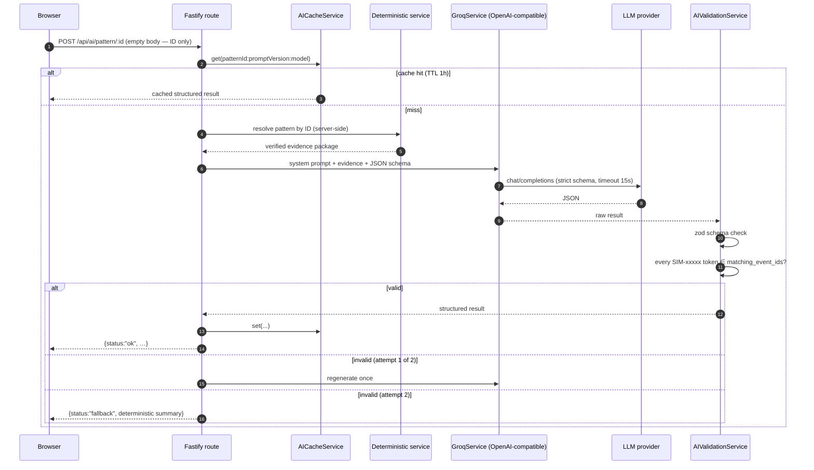
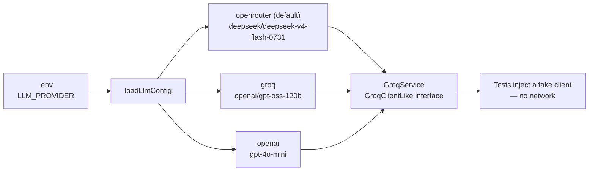

# The AI grounding architecture

This is the part that matters most. The LLM is treated as an untrusted
interpreter of trusted facts.

## The guarantees, concretely

| Guarantee | Where it is enforced |
| --- | --- |
| **The client cannot supply facts.** AI requests carry only an ID in the URL (and, for follow-ups, a 3–1000 char question). Body limit 2 KB. | `ai.routes.ts` — `isAcceptableEmptyBody`, `readFollowUpQuestion` |
| **Evidence is server-resolved** from the canonical dataset every time. | `buildObservedFacts`, `buildIssueEvidencePayload`, `RelationshipAiService` reads the same `*_brain.json` the UI renders |
| **Output shape is enforced twice** — provider-side `strict` JSON schema, then zod on arrival. | `GroqService` schemas + `AIValidationService` |
| **No fabricated evidence.** Any `SIM-\d{4,}` token anywhere in the response must be in the pattern/issue's own allowed event ids, or the whole response is rejected. | `validateGroqResult` / `validateGroqIssueResult` |
| **Bounded retries.** At most one regeneration (`MAX_VALIDATION_ATTEMPTS = 2`), then deterministic fallback. | `ai.routes.ts` |
| **No key in the browser.** The provider key lives only in the backend `.env`; it is never logged, echoed, or stored client-side. | `config/env.ts`, logger `redact` |
| **Rate limited.** 15 req/min for pattern & issue AI, 30 req/min for relationship AI, per route. | `@fastify/rate-limit` (registered **before** routes — see `app.ts`) |
| **Cache invalidates on prompt/model change.** Key is `id:promptVersion:model`. | `AICacheService` |
| **Degrades, never breaks.** No key ⇒ warning at boot, deterministic routes unaffected, AI panels show a fallback. | `assertUsable`, route fallbacks |

## Provider abstraction

OpenRouter, Groq and OpenAI all speak the same `chat/completions` protocol, so
switching is config-only — no request/response reshaping:

Model slugs are **pinned**, never `-latest`, so behaviour can't silently drift
between authoring and review. `LLM_BASE_URL` / `LLM_API_KEY` / `LLM_MODEL`
override everything for an unlisted provider.

## The prompt contract

Three versioned prompt builders (`src/prompts/`). The pattern and issue
analysts return the same disciplined 9–10 field structure:

| Field | Purpose |
| --- | --- |
| `strongestFinding` | The single most defensible observation |
| `interpretation` | What it plausibly means |
| `supportingEvidence` | Which verified facts back it |
| `weakeningEvidence` *(issues)* | What argues against it |
| `investigationHypothesis` | A testable statement |
| `whatWouldDisproveThis` | The falsifier — forces intellectual honesty |
| `whyItMayMatter` | Business relevance, hedged |
| `investigationQuestions` | 3–5 concrete next questions |
| `suggestedControl` | A candidate mitigation |
| `limitations` | Explicit caveats |

House rules baked into every prompt: synthetic data, correlation ≠ causation,
repeated people/orgs are described as **workflow concentration, never blame**,
and "insufficient evidence" is an acceptable answer.

---

[← Docs index](README.md) · [Project README](../README.md)
