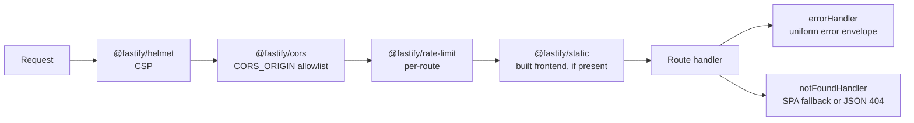

# HTTP API reference

Base URL: `http://localhost:3001` in dev (`VITE_API_BASE_URL` on the client).

## Deterministic routes — work with **no** LLM key

| Method | Path | Returns |
| --- | --- | --- |
| `GET` | `/api/health` | liveness payload |
| `GET` | `/api/patterns/priority` | the 22-pattern priority queue |
| `GET` | `/api/patterns/:patternId` | one pattern |
| `GET` | `/api/investigations/:patternId` | pattern + matching events + enterprise comparison + graph filter + deterministic summary |
| `GET` | `/api/issues` | 15 ranked issue summaries with triggered signals |
| `GET` | `/api/issues/:issueId` | full issue profile (financials, timeliness, breakdowns, counter-signals, related patterns) |
| `GET` | `/api/events/:eventId` | one risk event |

## AI routes — degrade to a deterministic fallback

| Method | Path | Body | Limits |
| --- | --- | --- | --- |
| `POST` | `/api/ai/pattern/:patternId` | *(empty)* | 2 KB · 15/min |
| `POST` | `/api/ai/pattern/:patternId/follow-up` | `{ question }` 3–1000 chars | 2 KB · 15/min |
| `POST` | `/api/ai/issue/:issueId` | *(empty)* | 2 KB · 15/min |
| `POST` | `/api/ai/issue/:issueId/follow-up` | `{ question }` | 2 KB · 15/min |
| `POST` | `/api/ai/streamgraph/period` | filters + period id | 15/min |
| `POST` | `/api/ai/streamgraph/event` | event id | 15/min |
| `POST` | `/api/ai/analyse` | flow/scope selector | 30/min |
| `POST` | `/api/ai/query` | free-form question | 8 KB · 30/min |

## Response envelopes

```jsonc
// success
{ "status": "ok", "result": { /* validated structured fields */ },
  "provider": "openrouter", "model": "deepseek/deepseek-v4-flash-0731" }

// graceful degradation — HTTP 200
{ "status": "fallback", "result": { /* deterministic summary */ }, "reason": "…" }

// error — HTTP 4xx/5xx, always this shape
{ "error": { "code": "PATTERN_NOT_FOUND", "message": "…", "requestId": "…" } }
```

Error codes in use: `PATTERN_NOT_FOUND`, `ISSUE_NOT_FOUND`, `EVENT_NOT_FOUND`,
`INVALID_REQUEST`, `AI_RESPONSE_INVALID`.

## Middleware stack



Two subtleties worth knowing:

1. **Plugins are `await`ed in order.** `@fastify/rate-limit` installs itself
   via an `onRoute` hook — a route registered before that hook exists silently
   gets *no* rate limiting. Awaiting each plugin before registering routes
   avoids that trap.
2. **CSP is relaxed only when serving the bundle.** The frontend is bundled by
   `vite-plugin-singlefile` (JS + CSS inlined), which helmet's default
   `script-src 'self'` would blank out. `'unsafe-inline'` is added *only* when
   `dist/` is actually being served; the API-only configuration keeps the
   strict default.

---

[← Docs index](README.md) · [Project README](../README.md)
