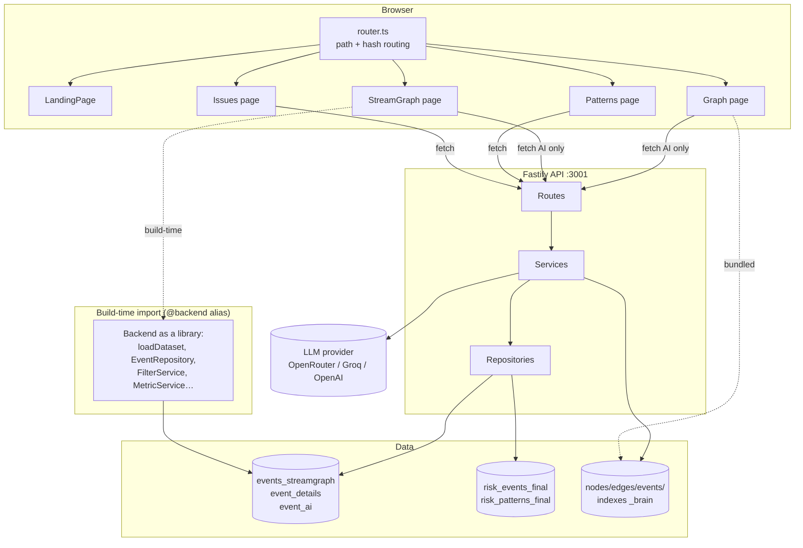

# Architecture at a glance

An npm-workspaces monorepo with two packages. The backend is *both* a
TypeScript library (imported directly by the frontend build via the `@backend`
alias) **and** a Fastify HTTP server.

**Two data-delivery strategies, on purpose:**

| Strategy | Used by | Why |
| --- | --- | --- |
| **Build-time embedding** (JSON imported into the bundle) | Streamgraph, Relationship Network | These are visual explorers over a fixed dataset. Embedding makes them work from a single static HTML file — even `file://` — with zero API dependency. |
| **Runtime HTTP fetch** | Executive Overview, Pattern Intelligence | Their content is *derived* (ranking, signals, comparisons) and computed once at server startup. Serving it keeps ranking logic and thresholds server-side and out of the client bundle. |

Repository layout: [repository-layout.md](repository-layout.md).

---

[← Docs index](README.md) · [Project README](../README.md)
