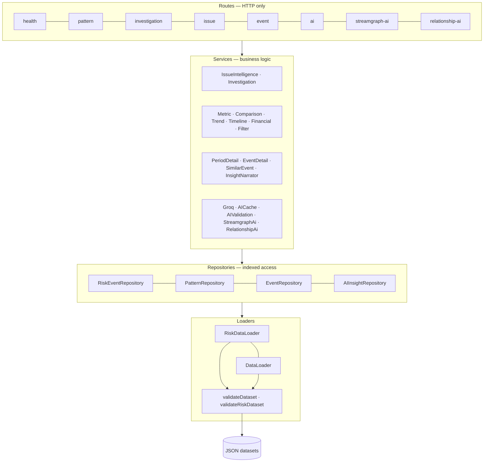

# Backend architecture

Strict layering — routes never touch data, services never touch HTTP.

**Composition root.** `buildApp(overrides)` builds but does not listen, so
tests `await buildApp({…})` and `.inject(…)` without binding a port, injecting
a fake LLM client and an in-memory dataset. `server.ts` is the thin listen
wrapper.

**Startup work, then O(1) reads.** `IssueIntelligenceService` computes all 15
profiles and the ranking once in its constructor and serves from memory
thereafter — repeated `GET /api/issues*` calls are map lookups.

**Fault isolation.** Both the streamgraph dataset and the relationship graph
dataset are loaded inside `try/catch` at startup. A failure removes only that
route group and logs a warning; the rest of the API boots normally.

**Same-origin single-command mode.** If `dist/` exists, the API serves the
built frontend itself, so the whole app runs on one port with no CORS at all.
The built filename is resolved *per request*, not cached at startup, because a
rebuild while the server is up would otherwise leave it serving a filename
that no longer exists.

---

[← Docs index](README.md) · [Project README](../README.md)
