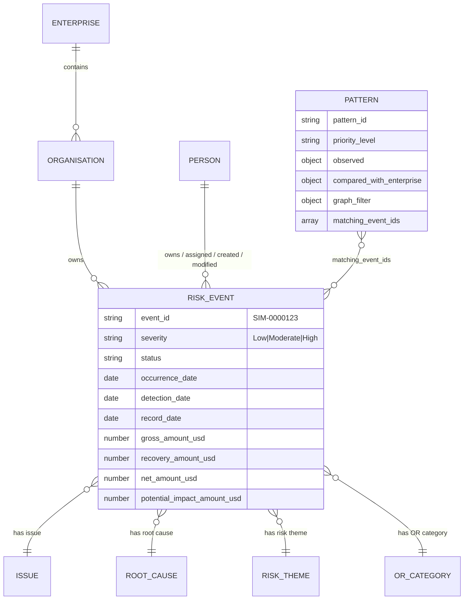

# The data layer

Five canonical JSON files. Nothing is computed at build time from anywhere
else, and nothing in the UI invents numbers.

## The five files

| File | Shape | Powers |
| --- | --- | --- |
| `events_streamgraph.json` | 1,000 narrative events | Streamgraph timeline |
| `event_details_streamgraph.json` | detail record per `SIM-…` id | Event drawer |
| `event_ai_streamgraph.json` | pre-generated period / event / trend insight text | Streamgraph insight fallbacks |
| `risk_events_final.json` | `{ definitions, enterprise, events[1000] }` | Issues page, patterns, all issue signals |
| `risk_patterns_final.json` | `{ enterprise, priority_queue[22], patterns[137] }` | Pattern Intelligence |
| `*_brain.json` (frontend `src/graph/data/`) | 1,136 nodes · 11,024 edges · 1,000 events · pre-built indexes | Relationship Network **and** the server-side relationship AI |

## Enterprise baseline (the comparison anchor)

Everything comparative in the app is measured against these figures, read
straight off `risk_events_final.json`:

| Metric | Baseline |
| --- | --- |
| Events | 1,000 (Low 705 · Moderate 244 · High 51) |
| High rate | 5.1% |
| Open rate | 72.1% (721 open) |
| Detection delay | mean 2.46 d · median 1 d |
| Recording delay | mean 3.61 d · median 3 d |
| Occurrence → record | mean 6.07 d · median 5 d |

## Graph model

- **8 node types** — `enterprise`, `organisation`, `person`, `event`, `issue`,
  `root_cause`, `risk_theme`, `or_category`
- **12 relation types** — `ORG_OWNS_EVENT`, `ORG_DISCOVERED_EVENT`,
  `PERSON_OWNS_EVENT`, `PERSON_ASSIGNED_EVENT`, `PERSON_ADMINISTERS_EVENT`,
  `PERSON_CREATED_EVENT`, `PERSON_MODIFIED_EVENT`, `EVENT_HAS_ISSUE`,
  `EVENT_HAS_ROOT_CAUSE`, `EVENT_HAS_RISK_THEME`, `EVENT_HAS_OR_CATEGORY`,
  `ENTERPRISE_CONTAINS_ORGANISATION`
- `indexes_brain.json` ships **pre-computed adjacency** (`node_to_events`,
  `node_to_edges`, `node_to_neighbors`, `nodes_by_type`, `edges_by_relation`,
  `search`) so no traversal is built at page load.

---

[← Docs index](README.md) · [Project README](../README.md)
