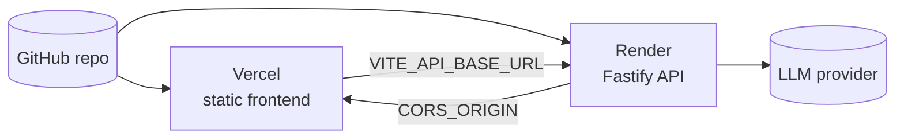

# Deployment

Two services. See [DEPLOY.md](../DEPLOY.md) for the full walkthrough.

1. **Backend → Render** via the shipped `render.yaml` blueprint. Runs
   TypeScript directly through `tsx`, no compile step. Set `CORS_ORIGIN` to
   your Vercel origin (**required**, or the browser blocks every call) and
   `OPENROUTER_API_KEY` for the AI panels. Health check: `/api/health`.
2. **Frontend → Vercel** via the shipped `vercel.json` — build command,
   `dist/` output, and an SPA rewrite so direct loads of `/streamgraph`,
   `/graph`, `/patterns` and `/issues` resolve. Set `VITE_API_BASE_URL` to the
   Render URL.
3. **Close the loop** — confirm `CORS_ORIGIN` matches the final Vercel domain
   and redeploy the backend if it changed.

Deploy the **backend first**, so you have its URL for the frontend build.

---

[← Docs index](README.md) · [Project README](../README.md)
