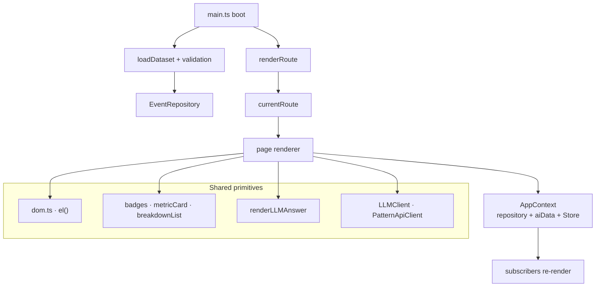

# Frontend architecture

Vanilla TypeScript — **no UI framework**. Rendering is explicit DOM
construction through a tiny `el()` helper, and state flows through a minimal
observable `Store`.

**Why no framework:** the two heaviest surfaces are an SVG streamgraph and a
`vis-network` canvas — both imperative by nature. A framework would sit
between the data and the drawing without earning its bundle cost, and the
single-file build target rewards a small dependency footprint.

**Boot sequence**

1. Show a loading state.
2. `loadDataset(...)` — validates the streamgraph dataset; **hard failure**
   renders a fatal-error card instead of a broken page.
3. Warnings are logged, not fatal; a regression check compares the loaded
   count against `DATASET_REGRESSION_TRUTHS.totalEvents` and warns on drift.
4. Build the `EventRepository`, wire `onRouteChange`, render.

**Styling** — layered CSS: `tokens.css` (design tokens) → `layout.css` →
`components.css` → `patterns.css` / `landing.css` → `responsive.css`. The
graph page keeps its own `graph/styles/` scoped under `.graph-page` so it
cannot leak.

**Build** — `vite-plugin-singlefile` emits one portable HTML document; the
root `build` script then renames it to `dist/risk-stream-explorer.html`. The
`@backend` alias lets the frontend import backend library code directly, so
the streamgraph's domain logic is shared, not duplicated.

---

[← Docs index](README.md) · [Project README](../README.md)
