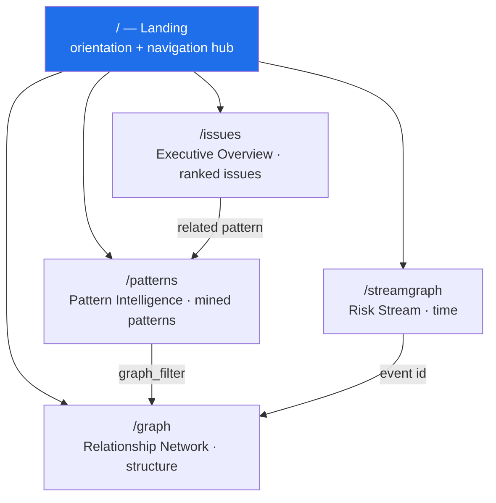

# The five pages

## Page guides

| Page | Route | What it answers | Guide |
| --- | --- | --- | --- |
| Landing | `/` | "Where do I start?" | [landing.md](landing.md) |
| Risk Stream | `/streamgraph` | "How did risk move over time?" | [streamgraph.md](streamgraph.md) |
| Relationship Network | `/graph` | "Who and what is connected?" | [relationship-network.md](relationship-network.md) |
| Executive Risk Overview | `/issues` | "Which issues deserve attention, and why?" | [issues.md](issues.md) |
| Pattern Intelligence | `/patterns` | "Which mined patterns are worth investigating?" | [patterns.md](patterns.md) |

## Routing

Routing supports **both** `/streamgraph` (http/https, needs SPA rewrite) and
`#/streamgraph` (for the single-file build opened from `file://`) — see
`router.ts`.

---

[← Docs index](../README.md) · [← All pages](README.md) · [Project README](../../README.md)
