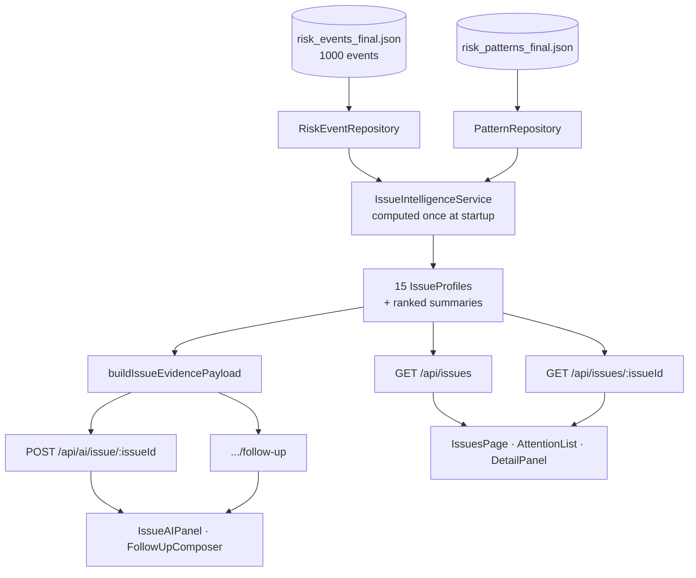

# Executive Risk Overview / Issues (`/issues`)

**Question:** which of the 15 issues deserve attention, and *why*?

This is the "why am I seeing this" layer. There is **no opaque composite AI
score** — `rankScore` is the documented sum of triggered-signal weights, and
every triggered signal is displayed with the real number behind it.

**The signal system** ([`config/issueSignals.ts`](../../backend/risk-stream-explorer/src/config/issueSignals.ts))

Every threshold was chosen by **profiling the shipped dataset**, and each is
documented with the observed range that justifies it:

| Signal | Threshold | Observed range |
| --- | --- | --- |
| High-severity rate lift vs enterprise | ≥ 1.4× | 0×–2.05× |
| Issue × root-cause combo lift (min 5 events) | ≥ 3.5× | 2.18×–7.84× |
| Total potential impact | ≥ $1.5 M | $807 K–$3.2 M |
| Net-exposure concentration (top 5 events) | ≥ 85% | 62.6%–97.2% |
| Open rate | ≥ 78% | 62.7%–80.6% (baseline 72.1%) |
| Mean detection delay | ≥ 2.8 d | 1.9–3.0 d (baseline 2.46) |
| Mean recording delay | ≥ 4.0 d | baseline 3.61 |
| Mean occurrence → record | ≥ 6.3 d | 5.4–6.8 d (baseline 6.07) |
| Per-org High-rate spread within an issue | ≥ 10 pp | 0–17.65 pp |

Plus **counter-signals** (metrics sitting *better* than baseline, shown so the
page argues both ways) and **small-sample caveats** attached automatically
whenever an org slice rests on fewer than 5 High events.

**Deliberate non-signals.** Event count per issue (66–67 for all 15),
organisations per issue (always 4), owners per issue (always 16) and
top-organisation volume share (always ~25.4%) are *flat by construction*.
Ranking or narrative built on them would be fabricated, so they are excluded —
and that exclusion is documented in the config file itself.

**Trend windowing.** Recent-vs-prior over complete calendar months, anchored
to the dataset's own last **complete** occurrence month — never wall-clock
"today". Anchoring naively would let the dataset's partial tail (2026-07/08,
81 events) manufacture a fake decline. A trend is only "material" at >25%
change with ≥5 events in the smaller window.

**Key files** — [`IssueIntelligenceService.ts`](../../backend/risk-stream-explorer/src/services/IssueIntelligenceService.ts),
[`issueSignals.ts`](../../backend/risk-stream-explorer/src/config/issueSignals.ts),
[`IssuesPage.ts`](../../frontend/risk-stream-explorer/src/components/IssuesPage.ts),
[`IssueAttentionList.ts`](../../frontend/risk-stream-explorer/src/components/IssueAttentionList.ts),
[`IssueDetailPanel.ts`](../../frontend/risk-stream-explorer/src/components/IssueDetailPanel.ts),
[`IssueAIPanel.ts`](../../frontend/risk-stream-explorer/src/components/IssueAIPanel.ts).

---

[← Docs index](../README.md) · [← All pages](README.md) · [Project README](../../README.md)
