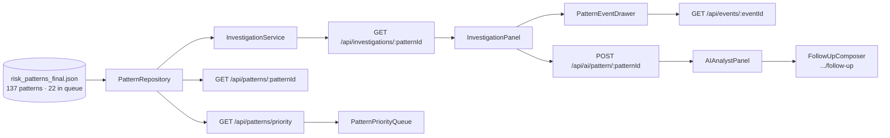

# Pattern Intelligence (`/patterns`)

**Question:** which of the 137 mined statistical patterns are worth an
analyst's time?

**What it does**

- **Priority queue** — the 22 patterns the miner flagged, each with its
  `priority_level` and explicit `priority_reasons`.
- **Investigation view** — `InvestigationService` composes pattern → matching
  events → enterprise comparison → a ready-made `graph_filter` that hands off
  to the Relationship Network. It performs **no statistics of its own**: every
  number is read straight off the pre-computed pattern object, so its output
  is correct by construction and never depends on the LLM being reachable.
- **Deterministic summary** — `buildDeterministicSummary` writes the
  facts-only paragraph (event count, High count, High rate vs enterprise with
  the lift multiple, open count). This is also what the AI panel falls back to.
- **Matching events** — drill into any `SIM-…` event from the pattern.
- **AI analyst** — the 9-field structured interpretation, with a grounded
  free-text follow-up composer underneath.

**Key files** — [`PatternIntelligencePage.ts`](../../frontend/risk-stream-explorer/src/components/PatternIntelligencePage.ts),
[`PatternPriorityQueue.ts`](../../frontend/risk-stream-explorer/src/components/PatternPriorityQueue.ts),
[`InvestigationPanel.ts`](../../frontend/risk-stream-explorer/src/components/InvestigationPanel.ts),
[`AIAnalystPanel.ts`](../../frontend/risk-stream-explorer/src/components/AIAnalystPanel.ts),
backend [`InvestigationService.ts`](../../backend/risk-stream-explorer/src/services/InvestigationService.ts),
[`PatternApiClient.ts`](../../frontend/risk-stream-explorer/src/services/PatternApiClient.ts).

---

[← Docs index](../README.md) · [← All pages](README.md) · [Project README](../../README.md)
