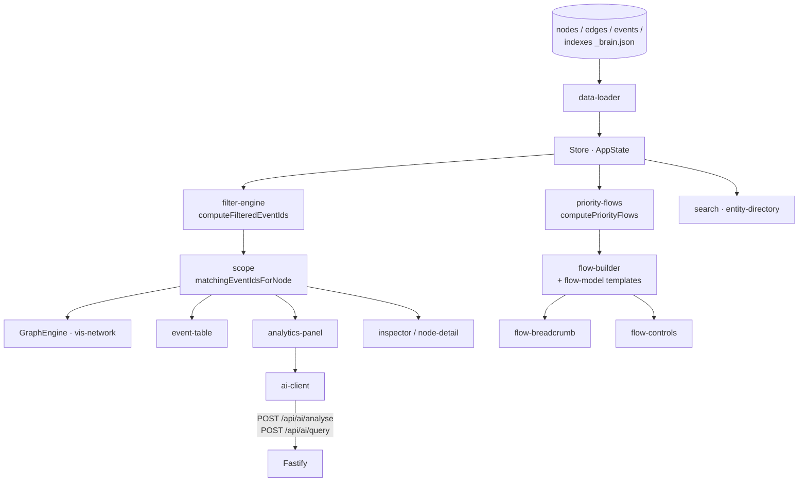

# Relationship Network (`/graph`)

**Question:** who and what is connected to this risk?

A self-contained explorer in `src/graph/` (its own state store, styles scoped
under `.graph-page`, and `vis-network` for rendering).

**What it does**

- **Network view** — 1,136 nodes / 11,024 edges, drawn from pre-built indexes.
  Node type styling, legend glyphs, severity colouring.
- **Filter panel** — multi-dimension filtering that resolves to a filtered
  event-id set; every other panel derives its content from that one set, so
  the graph, table and analytics can never disagree.
- **Priority flows** — `computePriorityFlows` ranks the notable
  organisation → issue → root-cause → person chains; **flow templates**
  (`flow-model.ts`, `FLOW_TOP_N`) render them as a Sankey-style column walk
  with a breadcrumb of how you got there.
- **Inspector / node detail** — for any selected node: its neighbours, its
  events, its role in the graph.
- **Event table** — sortable, scoped to the current selection.
- **Scope analytics** — severity mix, financials and timeliness for whatever
  is currently in scope.
- **AI analyst** — `POST /api/ai/analyse` (structured "why does this flow need
  attention") and `POST /api/ai/query` (free-form, 30 req/min). The server
  reads the **same** `*_brain.json` files, so the model never receives
  client-supplied facts.

**Key files** — [`index.ts`](../../frontend/risk-stream-explorer/src/graph/index.ts) (page composition),
[`graph-engine.ts`](../../frontend/risk-stream-explorer/src/graph/graph-engine.ts),
[`filter-engine.ts`](../../frontend/risk-stream-explorer/src/graph/filter-engine.ts),
[`priority-flows.ts`](../../frontend/risk-stream-explorer/src/graph/priority-flows.ts),
[`flow-model.ts`](../../frontend/risk-stream-explorer/src/graph/flow-model.ts),
backend [`RelationshipAiService.ts`](../../backend/risk-stream-explorer/src/services/RelationshipAiService.ts).

---

[← Docs index](../README.md) · [← All pages](README.md) · [Project README](../../README.md)
