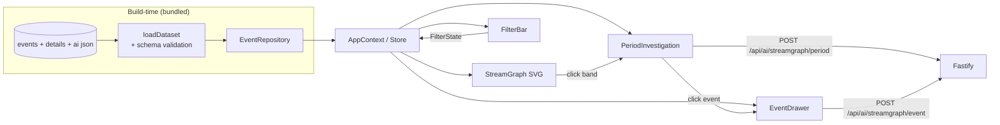

# Risk Stream / Streamgraph (`/streamgraph`)

**Question:** how did risk composition move over time?

**What it does**

- **Narrative timeline** rendered first, above the filters, so the visual is
  always the first thing on screen.
- **Filters & grouping** — severity, organisation, category, date range,
  granularity (period generation via `generatePeriods` / `getEventsInPeriod`).
- **Period investigation** — click a period to get its metrics
  (`MetricService`), a previous-period comparison (`ComparisonService`,
  `getPreviousPeriod`), trend facts ranked by materiality (`TrendService`:
  `detectTrendFacts` → `rankTrendFacts`) and a period narrative
  (`PeriodDetailService`, `InsightNarrator`).
- **Event drawer** — full detail record plus **similar events**
  (`SimilarEventService`) for the clicked `SIM-…` id.
- **AI analyst** — `POST /api/ai/streamgraph/period` and `/event`. The server
  re-derives the period or event from its own copy of the dataset (client
  sends filters + id only), then asks the model. Pre-generated insight text in
  `event_ai_streamgraph.json` backs the panel when the model is unavailable.

**Key files** — [`StreamGraph.ts`](../../frontend/risk-stream-explorer/src/components/StreamGraph.ts),
[`FilterBar.ts`](../../frontend/risk-stream-explorer/src/components/FilterBar.ts),
[`PeriodInvestigation.ts`](../../frontend/risk-stream-explorer/src/components/PeriodInvestigation.ts),
[`EventDrawer.ts`](../../frontend/risk-stream-explorer/src/components/EventDrawer.ts),
[`AIInsightPanel.ts`](../../frontend/risk-stream-explorer/src/components/AIInsightPanel.ts),
backend [`StreamgraphAiService.ts`](../../backend/risk-stream-explorer/src/services/StreamgraphAiService.ts).

> The streamgraph dataset is loaded **lazily and defensively** on the server:
> if it fails to load, only `/api/ai/streamgraph/*` goes missing — the rest of
> the API is unaffected (`createStreamgraphAiService` in `app.ts`).

---

[← Docs index](../README.md) · [← All pages](README.md) · [Project README](../../README.md)
