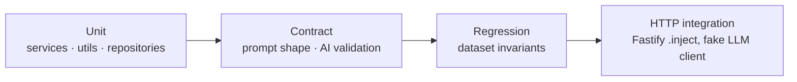

# Testing & quality gates

**26 test files · 200 tests**, one Vitest config spanning both workspaces.



| Layer | Covers |
| --- | --- |
| **Unit** | `MetricService`, `ComparisonService`, `TrendService`, `TimelineService`, `FilterService`, `FinancialService`, `SimilarEventService`, `PeriodDetail`/`InsightNarrator`, `IssueIntelligenceService`, `InvestigationService`, `dateUtils`, both repositories |
| **Contract** | `issueAnalysisPrompt` (the 9-field contract), `aiValidationService` (schema + hallucinated-event-id rejection), `groqService`, `aiCacheService` |
| **Regression** | `datasetRegression` / `riskDatasetRegression` — pin the dataset's shape and headline counts so silent data drift fails CI |
| **Integration** | `httpIntegration`, `issueRoutes`, `streamgraphAiRoutes` — real Fastify app via `.inject`, fake LLM client, **no network** |
| **Frontend** | `filter-engine`, `flow-templates`, `priority-flows` |

```bash
npm run typecheck && npm test
```

---

[← Docs index](README.md) · [Project README](../README.md)
